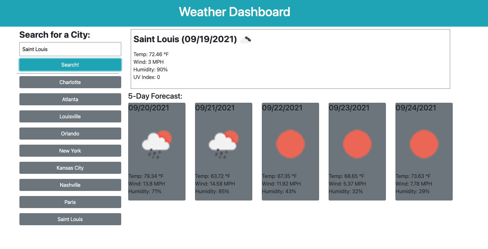

# Weather Dashboard

## Purpose
An app that will allow the user to enter a city, search the current weather and the 5-day forecast for selected city, and save the searched for cities for quick reference

## Built With
* HTML
* Bootstrap
* JavaScript

## Website
https://harvbcoding.github.io/weather-dashboard/

## Contribution
Made by Breania (Bre) Harvey

